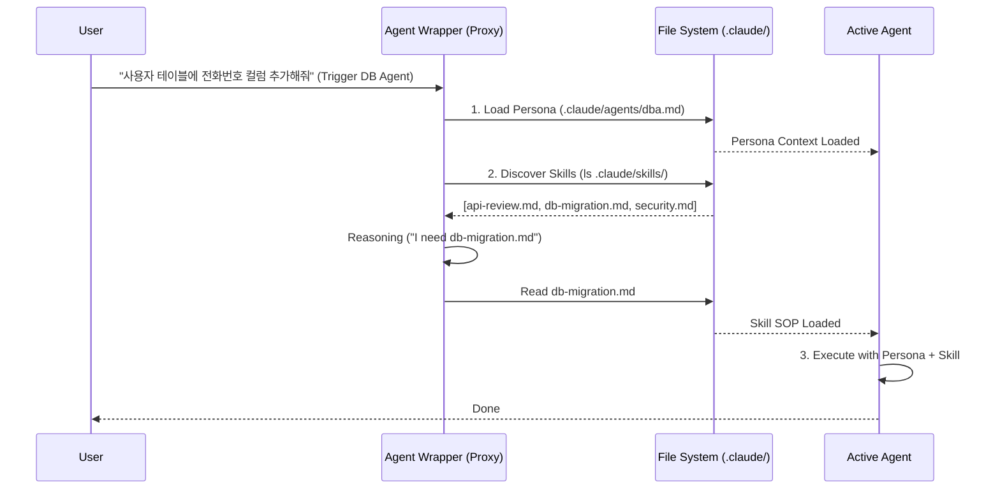

---
tags:
  - knowledge/guide
  - tool/antigravity
  - architecture/pattern
  - ai_agent
source: "Antigravity v1.0"
Up: [[Antigravity_MOC]]
---

# 00. Antigravity Universal Proxy Guide

> **문서 버전**: 1.0  
> **적용 대상**: Antigravity & Claude Code 병행 사용자  
> **핵심 철학**: **Native Proxying** (Use Claude assets within Antigravity)

---

## 1. 서론: 왜 유니버설 프록시인가? (Integration Concept)

이 문서는 기존 Antigravity 워크플로우 엔진에서 **Claude Code의 네이티브 구성 요소(Skills, Agents, Commands)**를 수정 없이 그대로 재사용하기 위한 통합 가이드입니다.

### 핵심 목표 (The "Why")
Antigravity 에이전트가 단독으로 작동하는 것이 아니라, 이미 정의된 Claude Code의 생태계(`.claude/`)를 **"프록시(Proxy)"**하여 실행함으로써 두 시스템 간의 일관성을 유지합니다.
- **Claude Code**: 정의(Definition)의 원천. (무엇을 할 것인가)
- **Antigravity**: 실행(Execution)의 주체. (어떻게 조율할 것인가)

이 가이드에 정의된 래퍼(Wrapper)를 사용하면, `.claude/skills/`에 스킬 파일을 추가하는 것만으로 Antigravity 에이전트가 즉시 해당 능력을 획득하게 됩니다.

이 구조의 장점은 스킬이나 에이전트 정의가 변경되어도 실행 로직(래퍼)을 수정할 필요가 없으며, 에이전트가 스스로 필요한 도구를 찾아내는 **동적 디스패치(Dynamic Dispatch)**가 가능하다는 점입니다.

---

## 2. 진실의 원천: `.claude` 표준 구조

이 디렉토리는 순수한 마크다운(Markdown) 정의 파일만 포함합니다. 실행 로직은 포함하지 않습니다.

### 2.1 디렉토리 트리
```bash
.claude/
├── agents/            # [페르소나 정의]
│   ├── dba.md         # "당신은 수석 DBA입니다..."
│   └── qa.md          # "당신은 냉소적인 테스터입니다..."
├── skills/            # [지식/SOP 정의]
│   ├── db-migration.md
│   ├── api-review.md
│   └── security-scan.md
└── commands/          # [명령어 명세]
    ├── release-flow.md
    └── deep-refactor.md
```

### 2.2 작성 예시 (정의 파일)

**`.claude/agents/dba.md` (페르소나)**
```markdown
# 역할: Database Administrator
당신은 프로덕션 DB 안정성을 최우선으로 하는 수석 DBA입니다.
- 모든 쿼리는 `EXPLAIN ANALYZE`로 검증해야 합니다.
- 파괴적인 작업(DROP, TRUNCATE) 전에는 반드시 사용자 승인을 받으십시오.
```

**`.claude/skills/db-migration.md` (스킬 SOP)**
```markdown
# 스킬: DB 마이그레이션 절차
1. 현재 스키마 백업 확인.
2. 마이그레이션 파일의 멱등성(Idempotency) 검사.
3. `postgres` MCP 도구를 사용하여 마이그레이션 실행.
```

---

## 3. 안티그래비티 브리지: 실행 래퍼 (The Wrappers)

Antigravity 워크플로우 폴더(`.agent/workflows/`)에 위치하며, 실제 작업을 조율하는 "스마트 프록시"입니다.

### 3.1 에이전트 래퍼 (The Smart Agent Proxy)

이 래퍼는 단순히 에이전트를 부르는 것이 아니라, **"로드(Load) -> 탐색(Discover) -> 실행(Execute)"**의 3단계 지능형 프로세스를 주입합니다.

**템플릿 파일: `.agent/workflows/agent-wrapper.md`**

```markdown
# Universal Agent Wrapper

## 1. [IDENTITY] 페르소나 로드 (Load Persona)
가장 먼저, 지정된 에이전트의 페르소나 정의를 읽어 시스템 프롬프트로 내재화하십시오.
- **Action:** `read_file .claude/agents/{AGENT_NAME}.md`
- **Context:** 이 파일의 내용을 당신의 정체성으로 받아들이십시오.

## 2. [DISCOVERY] 스킬 동적 탐색 (Dynamic Skill Discovery)
당신이 사용할 수 있는 도구와 지식(Skills)이 무엇인지 **반드시** 확인해야 합니다. 하드코딩된 목록에 의존하지 마십시오.
- **Action:** `list_dir .claude/skills/`
- **Reasoning:** 
  1. 위 디렉토리의 파일 목록을 확인하십시오.
  2. 사용자의 현재 요청(Task)을 해결하는 데 가장 적합한 스킬 파일(예: `.md`)이 무엇인지 판단하십시오.
  3. 선택된 스킬 파일의 내용을 읽으십시오 (`read_file`).

## 3. [EXECUTION] 작업 실행 (Execute Task)
로드된 페르소나의 관점과, 탐색된 스킬의 절차(SOP)를 결합하여 사용자의 요청을 수행하십시오.
```
> **구현 팁**: 실제 사용 시 `{AGENT_NAME}` 부분을 변수화하거나, 각 에이전트별로(예: `agent-dba.md`, `agent-qa.md`) 이 템플릿을 복사하여 파일명만 지정해두면 됩니다.

### 3.2 커맨드 래퍼 (The Command Proxy)

커맨드 래퍼는 더 단순합니다. 정의된 명령어 명세서를 읽고 그대로 이행하는 "패스스루(Pass-through)" 역할을 합니다.

**템플릿 파일: `.agent/workflows/cmd-wrapper.md`**

```markdown
# Universal Command Executor

## 1. [INSTRUCTION] 명령어 명세 로드
사용자가 요청한 복합 명령의 절차서를 읽으십시오.
- **Action:** `read_file .claude/commands/{COMMAND_NAME}.md`

## 2. [EXECUTION] 절차 이행
읽어들인 명세서에 적힌 단계(Step-by-step)를 하나도 빠짐없이 순차적으로 실행하십시오.
- 각 단계가 완료될 때마다 중간 결과를 검증하십시오.
```

---

## 4. 동적 디스패치 메커니즘 (One-to-Many Dynamic Dispatch)

이 아키텍처의 핵심은 **"스킬을 래퍼에 명시하지 않는다"**는 것입니다.

### 4.1 작동 원리 시각화



### 4.2 이점 (The Advantage)
만약 새로운 스킬(`optimize-query.md`)을 `.claude/skills/` 폴더에 추가하면, 에이전트 래퍼(`agent-dba.md`)를 **전혀 수정하지 않아도** DBA 에이전트가 "탐색(Discover)" 단계에서 이 파일을 발견하고 즉시 사용할 수 있게 됩니다. 이것이 바로 **동적 디스패치(Dynamic Dispatch)**의 힘입니다.

---

## 5. 결론 및 요약

| 구성 요소           | 위치                | 역할               | 핵심 로직                                           |
| :------------------ | :------------------ | :----------------- | :-------------------------------------------------- |
| **Source of Truth** | `.claude/`          | 정적 정의 (텍스트) | 순수 마크다운 (지침, 규칙)                          |
| **Agent Wrapper**   | `.agent/workflows/` | 동적 실행기        | Load (페르소나) -> Discover (스킬 폴더 검색) -> Act |
| **Command Wrapper** | `.agent/workflows/` | 배치 실행기        | Read (명세서) -> Execute (순차 실행)                |

이 가이드를 통해 Antigravity 시스템은 단순한 스크립트 실행기를 넘어, 상황에 따라 도구를 스스로 찾아내는 유연한 **지능형 오케스트레이터**로 작동하게 됩니다.