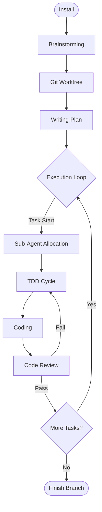

---
tags:
  - tool/claude-code
  - plugin/guide
  - methodology/tdd
  - ai_agent
source: "Obra/Superpowers (2026.01)"
Up: [[Claude_Plugin_Registry]]
---

# Claude Code Superpowers Guide: From Start to Finish

> **문서 버전**: 1.0
> **적용 대상**: Claude Code + Superpowers Plugin 사용자
> **핵심 가치**: TDD 강제, 정교한 계획 수립, AI 주도 개발의 구조화

---

## 1. 개요 (Overview)

**Superpowers([github](https://github.com/obra/superpowers))**는 Claude Code를 단순한 코딩 봇에서 "시니어 엔지니어링 파트너"로 격상시키는 필수 플러그인입니다. 이 가이드는 프로젝트의 시작부터 완성까지, Superpowers가 제공하는 8단계의 구조화된 워크플로우를 실전 예시(TODO 앱)와 함께 설명합니다.

### 1.1 슈퍼파워 워크플로우 (The Flow)



---

## 2. 단계별 가이드 (Step-by-Step Guide)

### 1단계: 설치 (Installation)
프로젝트 시작 전, Superpowers를 로컬 환경에 장착합니다.

- **Action**:
    ```bash
    /plugin marketplace add obra/superpowers-marketplace
    /plugin install superpowers@superpowers-marketplace
    ```
- **Verification**: `/help` 입력 시 `/superpowers:brainstorm` 등이 보이면 성공.

### 2단계: 브레인스토밍 (Brainstorming)
막연한 아이디어를 구체적인 설계 문서(`design.md`)로 정제합니다.

- **Trigger**: `/superpowers:brainstorm`
- **Focus**: "무엇을 만들까?" (What)
- **Example**:
    > **User**: "TODO 앱에 JWT 인증을 붙이고 싶어."
    > **Claude**: "DB는 무엇입니까? 토큰 만료 정책은?" (Socratic Questioning)
    > **Result**: `design.md` 파일 생성 (기술 스택, 아키텍처 확정).

### 3단계: 작업 공간 격리 (Git Worktree)
메인 브랜치를 오염시키지 않기 위해 격리된 작업 공간을 생성합니다.

- **Trigger**: `using-git-worktrees` (Auto)
- **Focus**: "어디서 작업할까?" (Where)
- **Logic**: 메인 폴더가 아닌 `worktrees/feature-auth` 폴더를 생성하여 의존성을 새로 설치하고 테스트 환경을 격리합니다. 병렬 개발에 필수적입니다.

### 4단계: 계획 수립 (Writing Plan)
거대한 작업을 "2~5분 단위"의 원자적 태스크로 쪼갭니다.

- **Trigger**: `/superpowers:write-plan`
- **Focus**: "어떻게 진행할까?" (How)
- **Result**: `plan.md` 생성.
    ```markdown
    1. [ ] User 스키마 작성 (models/User.js) - 검증: 스키마 컴파일
    2. [ ] 로그인 API 스켈레톤 (routes/auth.js) - 검증: 404 리턴 확인
    ...
    ```

### 5단계: 실행 루프 (Execution & Sub-agents)
계획된 태스크를 하나씩 실행합니다. 필요하다면 **서브 에이전트(Sub-agent)**를 호출하여 병렬로 처리합니다.

- **Trigger**: `/superpowers:execute-plan`
- **Mechanism**:
    1. **Plan Reader**: `plan.md`의 다음 항목을 읽음.
    2. **Context Slice**: 해당 태스크에 필요한 파일만 로드.
    3. **Action**: 코딩 시작.

### 6단계: TDD 강제 (Test Driven Development)
**Superpowers의 꽃**입니다. 테스트 없는 코드는 용납하지 않습니다.

- **Trigger**: `test-driven-development` (Auto & Forced)
- **Cycle**:
    1. **RED**: 실패하는 테스트 작성 (`tests/auth.test.js`).
    2. **Check**: 실패 확인 (증거 확보).
    3. **GREEN**: 최소한의 구현 코드 작성.
    4. **REFACTOR**: 중복 제거 및 최적화.

### 7단계: 코드 리뷰 (Code Review)
태스크 완료 직전, AI가 스스로 자신의 코드를 비판적으로 리뷰합니다.

- **Trigger**: `/superpowers:request-code-review`
- **Checklist**:
    - [ ] `plan.md`의 스펙을 준수했는가?
    - [ ] 보안 취약점(SQL Injection 등)은 없는가?
    - [ ] 하드코딩된 값은 없는가?

### 8단계: 마무리 (Finishing)
모든 태스크가 완료되면 브랜치를 정리하고 PR을 생성합니다.

- **Trigger**: `finishing-a-development-branch`
- **Action**:
    1. 전체 테스트 슈트 실행 (`npm test`).
    2. `main` 브랜치로 Merge 또는 GitHub PR 생성.
    3. Worktree 삭제 (디스크 정리).

---

## 3. 핵심 팁 (Pro Tips)

1.  **Context Management**: Superpowers는 강력하지만 무겁습니다. 긴 세션에서는 `/compact`를 자주 실행하거나, **서브 에이전트**에게 작업을 위임하여 메인 컨텍스트를 보호하십시오.
2.  **Customization**: 입맛에 맞지 않는 스킬이 있다면, `plan.md`에서 해당 스텝을 지우거나 수정하여 유연하게 대처하십시오.
3.  **Update**: `/plugin update superpowers`를 주기적으로 실행하여 최신 TDD 패턴을 내려받으십시오.

---

**See Also**:
- [[Claude_Code_Handbook]]: 클로드 코드 기본 사용법
- [[Claude_Plugin_Registry]]: 다른 추천 플러그인 목록