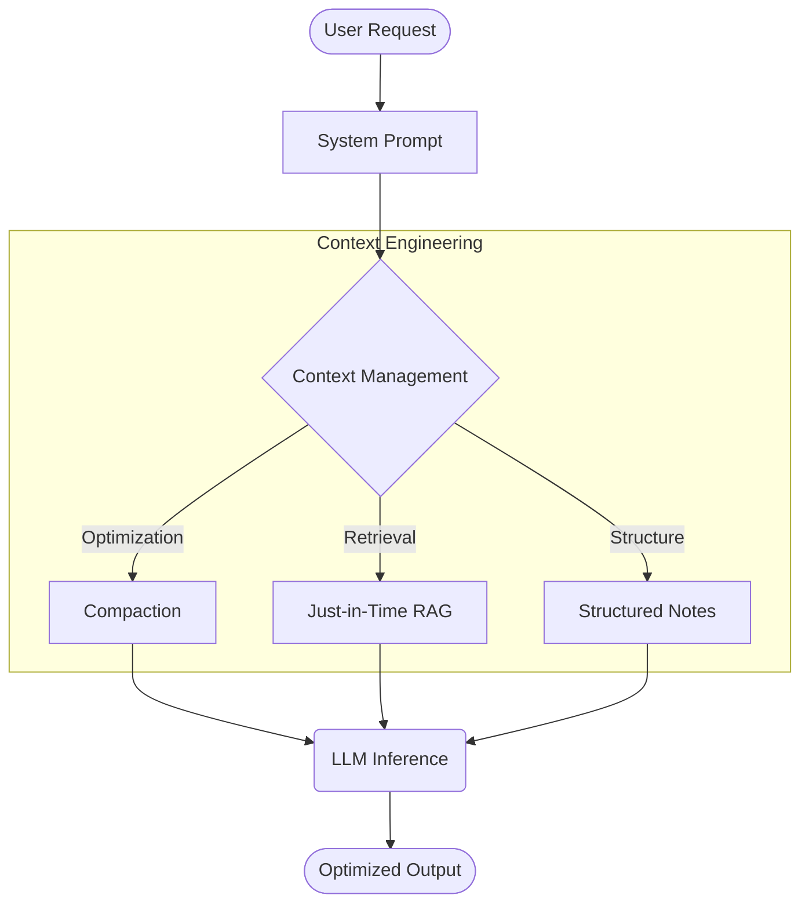

# Claude Superpowers Analysis: Context Engineering Perspective

사용자의 질문을 바탕으로, Anthropic(앤트로픽)의 **Context Engineering(컨텍스트 엔지니어링)** 개념을 먼저 설명한 후, **Claude Plugin Superpowers**가 무엇인지 소개하고, 이를 컨텍스트 엔지니어링 관점에서 분석합니다.

## 📖 1. Context Engineering 개요

Anthropic은 Context Engineering을 "**LLM(대형 언어 모델)의 추론 과정에서 제공되는 토큰(정보) 세트를 큐레이션하고 최적화하여 원하는 결과를 달성하는 실천**"으로 정의합니다.

### 🧠 The Loop (개념 도식)

### 🗝️ Core Strategies
- **Finite Resource**: 컨텍스트를 '무한한 캔버스'가 아닌 '제한된 예산(Budget)'으로 취급합니다.
- **Context Rot Prevention**: 대화가 길어질수록 성능이 저하되는 현상인 '컨텍스트 부패'를 막기 위해 적극적으로 개입합니다.
- **Long-term Techniques**:
    - **Compaction**: 오래된 대화를 요약하여 토큰을 회수합니다.
    - **Structured Note-taking**: 중요한 결정 사항을 별도 파일(`notes.md`)에 영구 기록합니다.

## ⚡ 2. Claude Plugin Superpowers 개요

**Superpowers**는 Claude Code를 위한 커뮤니티 플러그인으로, **에이전트에게 완전한 소프트웨어 개발 워크플로우를 제공**합니다. TDD 사이클을 강제하여 '환각(Hallucination)'을 방지하는 것이 핵심입니다.

## 🔍 3. Context Engineering 관점에서의 분석

Superpowers는 Context Engineering의 원칙을 실전적인 '스킬(Skill)' 형태로 잘 구현했으나, 장기적인 컨텍스트 관리 측면에서는 보완이 필요합니다.

### ✅ 강점 (Strengths)
1.  **Just-in-Time Loading**: `plans.md`나 `design.md`를 필요할 때만 읽어들여 토큰 효율성을 극대화합니다.
2.  **Sub-Agent Isolation**: `dispatching-parallel-agents` 스킬을 통해 복잡한 세부 구현을 서브 에이전트에게 위임, 메인 컨텍스트의 오염을 방지합니다.
3.  **Structured Persistence**: 브레인스토밍 결과를 휘발성 메모리가 아닌 파일 시스템에 저장하여 '외부 기억(External Memory)'으로 활용합니다.

### ⚠️ 약점 (Weaknesses)
1.  **Lack of Compaction**: 세션이 길어질 경우(수천 라인의 코드 수정), 컨텍스트 윈도우가 가득 차면 성능이 급격히 저하될 위험이 있습니다.
2.  **Domain Specificity**: 코딩 워크플로우(`git`, `npm test`)에 강하게 결합되어 있어, 일반적인 분석 업무에는 적용하기 어렵습니다.

## 🛠️ 4. 약점 극복 전략 (Improvements)

엔터프라이즈 환경에서 안정적으로 운용하기 위한 보완 전략입니다.

### 1) Compaction 기능 구현
- **Strategy**: 컨텍스트 사용량이 90%를 넘으면 자동으로 `compact` 스킬을 트리거합니다.
- **Action**: 현재까지의 `history`를 읽고 "해결된 문제"는 삭제하고 "남은 문제"만 요약하여 컨텍스트를 리셋합니다.

### 2) MCP (Model Context Protocol) 통합
- **Current**: 로컬 파일시스템에만 의존.
- **Future**: Slack, Jira, GitHub Issues 등 외부 MCP 서버와 연동하여, 개발 외적인 컨텍스트도 동적으로 가져올 수 있게 확장해야 합니다.

## 💡 Key Insights
- **Context as Budget**: AI에게 무작정 많은 정보를 주는 것이 능사가 아니다. **"무엇을 보여주지 않을 것인가"**를 결정하는 것이 Context Engineering의 핵심이다.
- **Tools are Context**: Superpowers의 스킬들은 단순한 함수가 아니라, 에이전트의 사고 과정을 가이드하는 '절차적 컨텍스트'다.
- **Evolution to Platform**: 커뮤니티 플러그인으로 시작했지만, 결국 Anthropic의 공식 MCP 프로토콜과 통합되어야 진정한 'Superpower'가 될 것이다.

---
**Source**: [[Claude_Code_Superpowers_Guide]] (Analysis based on User Input)