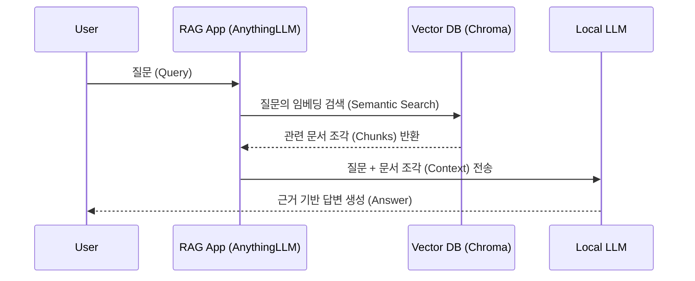

---
tags:
  - knowledge/topic
Source: Unknown / User Input
---

# RAG + LLM 구축 가이드 (M1 Max 64GB RAM 기준)

## 📖 개요 (Overview)
**[[RAG]](Retrieval-Augmented Generation)**를 로컬 LLM과 결합하면 M1 Max 64GB 환경에서 **프라이버시**와 **정확도**를 모두 잡을 수 있습니다. 64GB RAM은 70B 모델까지 구동 가능하므로 거대 모델의 추론 능력과 개인 데이터의 보안을 동시에 활용할 수 있는 최적의 환경입니다.

### RAG 파이프라인 흐름


## 🛠️ 추천 모델 (Recommended Models)
RAG에서는 문맥(Context)을 이해하고 답하는 능력이 중요하므로 **Instruct** 계열 모델이 필수입니다.

| 모델 크기                    | 추천 모델 (GGUF)                                                         | M1 Max (64GB) 적합성                            | 활용 제안                               |
| :--------------------------- | :----------------------------------------------------------------------- | :---------------------------------------------- | :-------------------------------------- |
| **속도 중시**<br>(7B~13B)    | **Qwen2.5-7B-Instruct** (Q5_K_M)<br>**Gemma-2-9B-It** (Q4_K_M)           | **🚀 초고속** (50+ t/s)<br>RAM 10~15GB 사용      | 단순 요약, 빠른 코드 리뷰               |
| **밸런스**<br>(13B~32B)      | **Qwen2.5-32B-Instruct** (Q5_K_M)<br>**Llama-3.1-22B-Instruct** (Q4_K_M) | **⚖️ 최적** (20~40 t/s)<br>RAM 20~30GB 사용      | 논문 분석, 복잡한 추론<br>*(가장 추천)* |
| **정확도 중시**<br>(32B~70B) | **Llama-3.1-70B-Instruct** (Q4_K_M)<br>**Mistral-Large** (Q4_K_M)        | **🧠 최고 성능** (10~20 t/s)<br>RAM 40~50GB 사용 | 전문 지식(법률/의학) 자문               |

> [!TIP] 임베딩 모델 (Essential)
> **`nomic-embed-text-v1.5` (Q4_K_M/F16)**: 작지만 강력한 성능으로 표준처럼 사용됩니다.

## ⚙️ 최적 설정 (Optimization)
M1 Max의 **Metal (MPS)** 가속을 극대화하기 위한 필수 설정입니다. macOS는 VRAM을 시스템 메모리와 공유(Unified Memory)하므로, OS와 기타 앱을 위해 **약 20~25%의 여유 메모리**를 남겨두는 것이 핵심입니다.

- **GPU Layers (`-ngl`)**: **Max / All**.
    - M1 Max는 CPU와 GPU가 메모리를 공유하므로, 데이터를 GPU로 복사할 필요가 없습니다. 가능한 모든 레이어를 GPU로 보내는 것이 가장 빠릅니다.
- **CPU Threads (`-t`)**: **8** (Logic Cores가 아닌 Performance Cores 개수).
    - M1 Max는 보통 8개의 고성능 코어(P-Core)를 가집니다. 이 숫자보다 높게 설정하면 효율 코어(E-Core)가 개입하여 오히려 성능이 저하될 수 있습니다.
- **Memory Lock (`--mlock`)**: **On** (메모리 스왑 방지).
    - 64GB RAM이 있으므로, 모델을 메모리에 고정시켜 디스크 스왑이 발생하지 않도록 합니다. 
- **Context Length**: `8192` ~ `32768`.
    - RAG는 문서 컨텍스트를 많이 필요로 합니다. 32B 모델 기준 16K 정도가 안정적입니다.
- **Process Priority**: (고급) `sudo`로 프로세스 우선순위를 높이면 약간의 지연 시간 단축 효과가 있습니다.

> [!WARNING] Memory Overhead
> 64GB RAM이라도 OS 구동(약 4~8GB)을 고려하면, 실제 모델과 Context Window가 사용할 수 있는 안전한 메모리는 **약 48~52GB**입니다. 이 한도를 넘으면 급격한 스왑으로 성능이 1/10 토막 납니다.

## 🚀 구축 가이드 (Implementation)
가장 쉽고 강력한 **AnythingLLM**을 활용한 로컬 RAG 구축 절차입니다.

### 1. 툴 설치 (Installation)
**Option A: Desktop App (추천 - 가장 간편)**
Mac M1 Max 환경에서는 Desktop 버전을 사용하는 것이 하드웨어 가속 활용과 관리에 가장 유리합니다.
1. **다운로드**: [AnythingLLM 공식 다운로드 페이지](https://useanything.com/download)에서 `MacOS (Apple Silicon)` 버전을 받습니다.
2. **Homebrew 설치**: 터미널에 익숙하다면 아래 명령어로 한 번에 설치할 수 있습니다.
   ```bash
   brew install --cask anythingllm
   ```
3. **실행**: `Applications` 폴더의 AnythingLLM을 실행합니다.

**Option B: Docker (서버용/고급 사용자)**
백그라운드 서비스로 띄우거나 멀티 유저 환경이 필요할 때 사용합니다. 데이터를 유지하려면 볼륨 마운트가 필수입니다.
```bash
# 기본 데이터 영구 저장을 위한 폴더 생성 및 실행
export STORAGE_LOCATION=$HOME/anythingllm && \
mkdir -p $STORAGE_LOCATION && \
touch "$STORAGE_LOCATION/.env" && \
docker run -d -p 3001:3001 \
--cap-add SYS_ADMIN \
-v ${STORAGE_LOCATION}:/app/server/storage \
-v ${STORAGE_LOCATION}/.env:/app/server/.env \
-e STORAGE_DIR="/app/server/storage" \
mintplexlabs/anythingllm
```
- 브라우저에서 `http://localhost:3001` 접속.

### 2. 모델 연동
- **LLM Provider**: Ollama 또는 LM Studio 로컬 서버 연결.
- **Embedder**: AnythingLLM 내장 `nomic-embed-text` 사용 추천.

### 3. 지식 베이스(Vector DB) 생성
- 새 워크스페이스 생성 -> **Files** 탭에서 문서(PDF, MD) 업로드.
- **Move to Workspace** 클릭 시 자동으로 Chunking & Embedding 수행.
- *Vector DB는 기본 내장된 LanceDB 사용을 추천 (관리 불필요 및 빠름).*

### 4. 테스트
- 채팅창 설정에서 `Retrieval Mode`를 확인하고 질문 입력.
- 답변 하단의 **Citations**를 클릭하여 원본 문서의 출처 확인.

## 💡 Key Insights
- **Local RAG의 가치**: 내 데이터가 외부로 나가지 않는 **완벽한 보안** 환경에서, GPT-4급의 대화형 검색을 구현할 수 있습니다.
- **M1 Max의 이점**: 64GB Unified Memory는 32B~70B급 모델을 양자화하여 올릴 수 있는 **마지노선이자 스윗 스팟**입니다.
- **Tip**: 처음에는 작은 모델(7B)로 파이프라인이 도는지 확인하고, 점차 32B 모델로 올려서 답변 품질을 높이세요.
