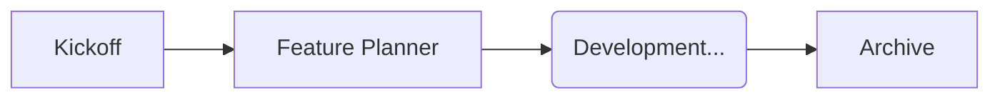

# 06. Lifecycle Combo (프로젝트 생애주기)

**Goal**: 프로젝트의 시작부터 끝까지를 책임지는 3가지 워크플로우(`Kickoff`, `Planner`, `Archive`)의 연결 흐름을 익힙니다.

## 1. The Pipeline

### Step 1: 시작 (Kickoff)
- **명령**: `/project_kickoff`
- **역할**: "깨끗한 책상 준비".
- **준비물**: 프로젝트 이름, 타입(Study/Dev).
- **결과**: `Overview`, `Plan`, `Git` 환경이 세팅됨.

### Step 2: 진행 (Feature Planner)
- **명령**: `/feature_planner`
- **역할**: "지도 보고 운전하기".
- **준비물**: `plan-template.md`.
- **결과**: `implementation_plan.md` (구현 계획서).
- **반복**: 기능 하나 만들 때마다 이 워크플로우를 돌립니다.

### Step 3: 종료 (Archive)
- **명령**: `/archive_project`
- **역할**: "책상 치우고 퇴근하기".
- **준비물**: 완료된 프로젝트.
- **결과**: `90_Archives`로 이동, `20_Learning`으로 지식 이관(Harvesting).

## 2. 시나리오 실습 (Toy Project)
1. `/project_kickoff` -> `Toy_Calculator` 생성.
2. `/feature_planner` -> "덧셈 기능 구현" 계획 수립.
3. `/archive_project` -> 프로젝트 종료 및 삭제.
