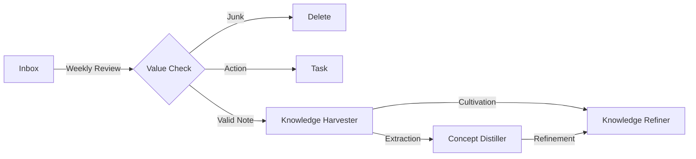

# 07. Knowledge Combo (지식 선순환)

**Goal**: 임시 메모가 영구적인 지식이 되는 과정(`Review`, `Harvester`, `Distiller`)을 체화합니다.

## 1. The Pipeline

### Step 1: 수집 및 분류 (Weekly Review)
- **명령**: `/weekly_review`
- **대상**: `00_Inbox`에 쌓인 메모들.
- **역할**: 쓰레기통 비우기 + 보석 골라내기.

### Step 2: 이관 (Harvester)
- **명령**: `/knowledge_harvester`
- **대상**: 분류된 가치 있는 노트들.
- **역할**: `20_Learning/10_Topics`로 **이사(Move)** 시키기.

### Step 3: 정제 (Distiller)
- **명령**: `/concept_distiller`
- **대상**: 이관된 노트 속의 핵심 용어들.
- **역할**: `20_Learning/00_Concepts`로 **추출(Extract)** 하기.

### Step 4: 고도화 (Refiner)
- **명령**: `/knowledge_refiner`
- **대상**: 이미 저장된 지식 노트들.
- **역할**: 내용을 심화하고(`Standardization`), 다이어그램을 추가(`Multimodal`)하여 '골드 스탠다드'로 만듦.

## 2. 시나리오 실습
1. `00_Inbox`에 `React_Study.md`를 만들고 아무 말이나 씁니다.
2. `/weekly_review`를 돌려서 이 파일을 확인합니다.
3. `/knowledge_harvester`로 `20_Learning`으로 보냅니다.
4. `/concept_distiller`로 그 안의 "Virtual DOM" 같은 단어를 추출해 봅니다.
5. `/knowledge_refiner`를 실행해 "Virtual DOM" 노트에 다이어그램을 추가해 봅니다.
