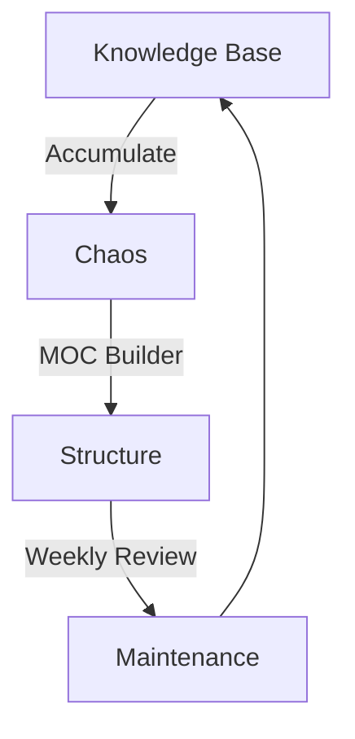

# 08. Maintenance Combo (구조 유지보수)

**Goal**: 지식 베이스가 커질수록 무너지기 쉬운 구조를 `[[MOC]]`와 `Review`로 단단하게 유지합니다.

## 1. The Loop

### Step 1: 지도 그리기 (MOC Builder)
- **명령**: `/moc_builder`
- **상황**: 폴더 안에 파일이 10개 넘어가서 한눈에 안 보일 때.
- **역할**: 자동으로 목차(`_MOC`)를 만들어줌.

### Step 2: 지도 점검 (Weekly Review)
- **명령**: `/weekly_review` (또는 수동 점검)
- **상황**: 새 노트는 계속 추가되는데 MOC에는 반영이 안 될 때.
- **역할**: "Orphaned Notes(고아 노트)"를 찾아서 MOC에 다시 연결해줌.

## 2. 시나리오 실습
1. `20_Learning` 폴더 중 가장 파일이 많은 곳을 찾습니다.
2. `/moc_builder`를 실행해서 지도를 만듭니다.
3. 일부러 링크를 하나 지우고, 다음 주 `Weekly Review` 때 발견되는지 확인해 봅니다.
