Source: [[Obsidian_Documentation_Mastery_Overview]]
# 03. Antigravity Basic (AI 활용 기초)

**Goal**: AI 에이전트를 나만의 비서로 활용하기.

## 1. 기본 대화
채팅창에서 자연어로 질문하면, 현재 열려 있는 문서의 컨텍스트를 인식하여 답변합니다.
- **예시**: "이 문서의 핵심 내용을 3줄로 요약해줘."

### 시각화: AI와의 대화 루프

```mermaid
sequenceDiagram
    participant User as 👤 사용자
    participant Agent as 🤖 안티그래비티
    participant Vault as 📂 옵시디언 볼트

    User->>Agent: 질문 (e.g. "@[Obsidian] 요약해줘")
    Agent->>Vault: 파일 읽기 (Read Context)
    Vault-->>Agent: 파일 내용 반환
    Agent->>Agent: 생각 및 답변 생성
    Agent-->>User: 답변 출력
```

## 2. 파일/폴더 참조 (`@`)
특정 파일이나 폴더를 콕 집어서 질문할 수 있습니다.
- **문법**: `@`를 입력하면 파일 리스트가 나옵니다.
- **활용**:
    - `@[Obsidian_Structure_Guide] 내용을 참고해서 내 저널 폴더 구조를 점검해줘.`
    - `@[20_Learning] 폴더에 있는 노트들 중에서 'React'와 관련된 것들을 찾아줘.`

## 3. 슬래시 커맨드 (`/`)
/미리 정의된 워크플로우를 실행합니다.
- **`/project_kickoff`**: 새 프로젝트 시작.
- **`/weekly_review`**: 주간 회고.
- **`/concept_distiller`**: 지식 추출.

## 4. 실습 미션
이 문서를 AI에게 요약해달라고 요청해 보세요.
> "지금 보고 있는 @[03_Antigravity_Basic] 파일을 요약해줘."

---
**Completion**: Phase 1 학습을 완료했습니다! [[../Obsidian_Documentation_Mastery_Plan|플랜으로 돌아가기]]
