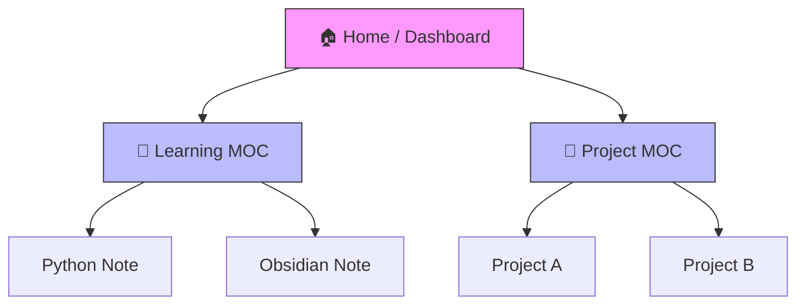

Source: [[Obsidian_MOC]]
# 05. MOC & Search (지도와 나침반)

- **Goal**: 내 볼트 안에서 길을 잃지 않는 법.

## 1. Omnisearch (전지적 검색)
기본 검색보다 훨씬 강력한 검색 엔진입니다. 이미지 내의 텍스트(OCR)나 PDF 내용까지 찾아줍니다.
- **사용법**: `Cmd + P` -> `Omnisearch: Search` 실행.
- **실습**: 기억나는 단어를 검색해 보고, 결과가 얼마나 빠르고 정확한지 체감해 보세요.

## 2. [[MOC]] (Map of Content) 구축
[[MOC]]는 노트들의 '목차'이자 '지도'입니다. 폴더 구조에 얽매이지 않고 관련 노트를 한곳에 모읍니다.
- **생성 방법 (AI 활용)**:
    - 안티그래비티에게 요청: "현재 `20_Learning` 폴더에 있는 파일들을 리스트업해서 MOC 포맷으로 만들어줘."
- **실습**:
    - `10_Projects` 폴더의 MOC를 직접 만들어보세요. (제목: `Projects_MOC.md`)
    - 안에 `Project_A`, `Project_B` 링크를 나열하면 됩니다.

### 시각화: MOC의 구조

---
**Next**: [[06_Connecting_Notes]] 로 넘어가세요.

## 💡 Key Insights
*   **생각의 공항**: MOC(Map of Content)는 생각의 '공항'과 같아서, 방대한 지식의 바다에서 길을 잃지 않고 언제든 원하는 목적지로 출발할 수 있는 거점이 됩니다.
*   **검색의 진화**: 단순 키워드 검색을 넘어 Omnisearch를 활용하면, 내 기억의 불완전함을 기술(Tech)로 보완할 수 있습니다.
