Source: [[Obsidian_Documentation_Mastery_Overview]]
# 05. MOC & Search (지도와 나침반)

**Goal**: 내 볼트 안에서 길을 잃지 않는 법.

## 1. Omnisearch (전지적 검색)
기본 검색보다 훨씬 강력한 검색 엔진입니다. 이미지 내의 텍스트(OCR)나 PDF 내용까지 찾아줍니다.
- **사용법**: `Cmd + P` -> `Omnisearch: Search` 실행.
- **실습**: 기억나는 단어를 검색해 보고, 결과가 얼마나 빠르고 정확한지 체감해 보세요.

## 2. [[MOC]] (Map of Content) 구축
[[MOC]]는 노트들의 '목차'이자 '지도'입니다. 폴더 구조에 얽매이지 않고 관련 노트를 한곳에 모읍니다.
- **생성 방법 (AI 활용)**:
    - 안티그래비티에게 요청: "현재 `20_Learning` 폴더에 있는 파일들을 리스트업해서 MOC 포맷으로 만들어줘."
- **실습**:
    - `10_Projects` 폴더의 MOC를 직접 만들어보세요. (제목: `Projects_MOC.md`)
    - 안에 `[[Project_A]]`, `[[Project_B]]` 링크를 나열하면 됩니다.

### 시각화: MOC의 구조

```mermaid
graph TD
    Home[🏠 Home / Dashboard] --> MOC_Learning[🧠 Learning MOC]
    Home --> MOC_Project[🚀 Project MOC]
    
    MOC_Learning --> Python[[Python Note]]
    MOC_Learning --> Obsidian[[Obsidian Note]]
    
    MOC_Project --> ProjA[[Project A]]
    MOC_Project --> ProjB[[Project B]]
    
    style Home fill:#f9f,stroke:#333
    style MOC_Learning fill:#bbf,stroke:#333
    style MOC_Project fill:#bbf,stroke:#333
```

---
**Next**: [[06_Connecting_Notes]] 로 넘어가세요.
