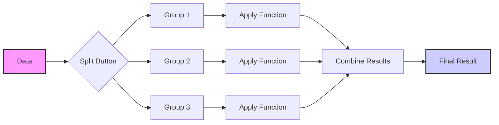

---
tags:
  - knowledge/topic
Source: [[GitHub_Study_Python]]
---

# 02-1. Pandas 심화: 데이터 처리 및 분석

## 📖 정의 (Definition)
**Pandas 심화** 과정에서는 그룹 분석(Split-Apply-Combine), 피벗 테이블, 복잡한 데이터 변환 및 결측치 처리 등 실무 데이터 분석에 필요한 고급 기법들을 다룹니다.

---

이 문서는 Pandas의 기본적인 사용법을 넘어, **데이터 분석의 핵심**인 그룹 분석, 피벗 테이블, 고급 집계 및 변환 기법을 다룹니다. 실무에서 자주 마주하는 복잡한 데이터 처리 시나리오를 해결하기 위한 심화 내용을 포함합니다.

---

## 1. 그룹 분석 (Group Analysis)

데이터 분석의 가장 강력한 도구 중 하나는 데이터를 특정 기준에 따라 그룹화하고, 각 그룹에 대해 연산을 수행하는 것입니다. 이를 **Split-Apply-Combine** 전략이라고 합니다.

### 1.1 Split-Apply-Combine 전략
1.  **Split (분할)**: 데이터를 특정 키(key)를 기준으로 작은 그룹으로 나눕니다.
2.  **Apply (적용)**: 각 그룹에 대해 함수(집계, 변환, 필터링)를 적용합니다.
3.  **Combine (결합)**: 결과를 다시 하나의 데이터 구조로 합칩니다.



### 1.2 `groupby` 객체 심층 탐구

`groupby()`를 호출하면 데이터가 바로 변환되는 것이 아니라 `DataFrameGroupBy` 객체가 생성됩니다.

```python
import pandas as pd
import numpy as np

df = pd.DataFrame({
    '부서': ['영업', '영업', '인사', '인사', '개발', '개발'],
    '팀': ['1팀', '2팀', '1팀', '2팀', '1팀', '2팀'],
    '연도': [2023, 2023, 2023, 2023, 2024, 2024],
    '매출': [100, 120, 80, 90, 150, 160],
    '비용': [50, 60, 40, 45, 70, 80]
})

# groupby 객체 생성
g = df.groupby('부서')
print(g)  # <pandas.core.groupby.generic.DataFrameGroupBy object at ...>
```

> [!NOTE]
> **범주형 데이터 주의**: `groupby` 역시 범주형 데이터 사용 시 `observed` 파라미터에 대한 FutureWarning이 발생할 수 있습니다. 자세한 내용은 [7. 주요 FutureWarning 및 주의사항](#7-주요-futurewarning-및-주의사항)을 참조하세요.

**그룹 순회 (Iteration)**:
```python
for name, group in g:
    print(f"=== {name} ===")
    print(group)
```

**여러 열로 그룹화**:
```python
# 부서와 연도별 그룹화
g_multi = df.groupby(['부서', '연도'])
```

---

## 2. 고급 집계 (Aggregation)

단순한 `sum()`, `mean()`을 넘어 복잡한 집계 작업을 수행합니다.

### 2.1 `agg()` 메서드 활용

`agg()` (또는 `aggregate()`)를 사용하면 여러 함수를 동시에 적용하거나, 열마다 다른 함수를 적용할 수 있습니다.

```python
# 1. 여러 함수 동시 적용
print(df.groupby('부서')['매출'].agg(['sum', 'mean', 'std']))

# 2. 열마다 다른 함수 적용 (딕셔너리 활용)
agg_dict = {
    '매출': 'sum',       # 매출은 합계
    '비용': ['mean', 'max'] # 비용은 평균과 최대값
}
print(df.groupby('부서').agg(agg_dict))
```

### 2.2 사용자 정의 집계 함수

기본 함수 외에 복잡한 로직이 필요한 경우 사용자 정의 함수를 적용할 수 있습니다.

```python
def range_func(x):
    """최대값과 최소값의 차이(범위) 계산"""
    return x.max() - x.min()

print(df.groupby('부서')['매출'].agg(range_func))
```

### 2.3 Named Aggregation (이름 지정 집계)

결과 열의 이름을 명시적으로 지정하여 가독성을 높입니다. (Pandas 0.25+)

```python
result = df.groupby('부서').agg(
    총매출=('매출', 'sum'),
    평균비용=('비용', 'mean'),
    최대매출=('매출', 'max')
)
print(result)
```

---

## 3. 변환과 필터링 (Transformation & Filtration)

집계(Aggregation)가 그룹당 하나의 값을 반환한다면, 변환(Transformation)은 그룹의 크기만큼 결과를 반환하고, 필터링(Filtration)은 그룹 전체를 유지하거나 버립니다.

### 3.1 `transform()`: 그룹별 연산 결과를 원본에 매핑

`transform`은 그룹별로 계산된 값(예: 평균)을 **각 그룹의 모든 행에 동일하게 적용(Broadcasting)**하여 반환합니다. 결과의 행 개수가 원본 데이터와 동일하므로, 원본 데이터프레임에 새로운 열로 추가하기에 적합합니다.

- **입력**: 그룹화된 데이터
- **동작**: 그룹별 함수 적용 -> 결과를 그룹 크기만큼 확장
- **출력**: 원본 인덱스와 동일한 크기의 Series 또는 DataFrame

```python
# 부서별 매출 평균 계산
dept_mean = df.groupby('부서')['매출'].transform('mean')

# 원본 데이터에 '부서평균매출' 열 추가
df['부서평균매출'] = dept_mean
df['평균대비차이'] = df['매출'] - df['부서평균매출']
```

### 3.2 `filter()`: 조건에 맞는 그룹만 남기기

그룹의 속성(예: 그룹의 크기, 그룹의 평균 값 등)을 기준으로 데이터를 필터링합니다.

```python
# 매출 합계가 200 이상인 부서만 남기기
def filter_func(x):
    return x['매출'].sum() >= 200

filtered_df = df.groupby('부서').filter(filter_func)
print(filtered_df['부서'].unique())  # 매출 합계가 조건에 맞는 부서만 출력
```

### 3.3 `apply()`: 가장 유연한 그룹 연산

`apply()`는 분할된 각 데이터프레임에 임의의 함수를 적용하고 결과를 합칩니다. 가장 느리지만 가장 유연합니다.

```python
def top_2_by_sales(x):
    """매출 기준 상위 2개 행 반환"""
    return x.sort_values('매출', ascending=False).head(2)

print(df.groupby('부서').apply(top_2_by_sales))
```

### 3.4 비교 및 요약: `agg` vs `transform` vs `apply`

그룹 연산 메서드는 비슷해 보이지만 결과의 형태와 용도가 다릅니다.

| 특징 | `agg` (Aggregation) | `transform` (Transformation) | `apply` (General) |
| :--- | :--- | :--- | :--- |
| **결과 형태** | **축소됨** (그룹당 1개 행) | **원본 유지** (원본과 동일한 행 수) | **유연함** (함수에 따라 다름) |
| **주요 용도** | 합계, 평균 등 요약 통계 | 정규화, 결측치 채우기, 그룹별 연산값 전파 | 복잡한 로직, 상위 N개 추출, 사용자 정의 함수 |
| **작동 방식** | 열(Column) 단위로 독립적 연산 | 열 단위 연산 후 원본 인덱스에 매핑 | 그룹(DataFrame) 전체를 입력으로 받아 처리 |
| **성능** | 빠름 (최적화됨) | 빠름 | 상대적으로 느림 |

**언제 무엇을 써야 할까?**
- **그룹별로 하나의 값**을 원한다면? → `agg()`
- **원본 데이터에 그룹별 계산 값을 붙이고** 싶다면? → `transform()`
- **복잡한 조건**이나 **행 단위 처리**가 필요하다면? → `apply()`

---

## 4. 피벗 테이블과 크로스탭 (Pivot Table & Crosstab)

### 4.1 `pivot_table()`

엑셀의 피벗 테이블과 유사한 기능을 제공합니다. 데이터를 재구조화하여 요약 통계를 보여줍니다.

**기본 구조**:
`pd.pivot_table(data, values=None, index=None, columns=None, aggfunc='mean', fill_value=None)`

```python
# 부서(행)와 연도(열)별 매출 합계
pivot = pd.pivot_table(
    df,
    values='매출',
    index='부서',
    columns='연도',
    aggfunc='sum',
    fill_value=0,  # 결측치 0으로 채움
    margins=True,  # 총계(All) 추가
    margins_name='총계'
)
print(pivot)
```

> [!WARNING]
> **FutureWarning: `observed` 파라미터**
> 범주형(Categorical) 데이터 사용 시 `observed=False` 기본값이 향후 버전에서 `True`로 변경될 예정입니다.
> - **`observed=False` (현재 기본)**: 데이터에 없는 범주도 표시 (0 또는 NaN)
> - **`observed=True` (향후 기본)**: 관측된 범주만 표시
>
> 경고를 끄고 현재 동작을 유지하려면 명시적으로 `observed=False`를 지정하세요.
> ```python
> pivot = pd.pivot_table(df, ..., observed=False)
> ```

**다중 집계 함수**:
```python
# 매출의 합계와 평균을 동시에
pivot_multi = pd.pivot_table(
    df,
    values=['매출', '비용'],
    index=['부서', '팀'],
    aggfunc={'매출': 'sum', '비용': 'mean'}
)
```

### 4.2 `crosstab()`

범주형 데이터의 빈도수(도수 분포표)를 구할 때 특화된 함수입니다.

```python
# 샘플 데이터
data = pd.DataFrame({
    '성별': ['남', '여', '남', '여', '남'],
    '등급': ['A', 'B', 'A', 'A', 'B']
})

# 성별-등급별 빈도수
ct = pd.crosstab(data['성별'], data['등급'], margins=True)
print(ct)

# 비율로 표시 (normalize)
ct_norm = pd.crosstab(data['성별'], data['등급'], normalize='index') # 행 기준 비율
print(ct_norm)
```

### 4.3 비교: `groupby` vs `pivot_table` vs `crosstab`

세 기능 모두 데이터를 그룹화하고 집계한다는 공통점이 있지만, 사용 목적과 편의성에 차이가 있습니다.

| 기능 | `groupby` | `pivot_table` | `crosstab` |
| :--- | :--- | :--- | :--- |
| **주 목적** | 범용적인 그룹 연산 | 데이터 재구조화 (Spreadsheet 형태) | 범주형 데이터의 빈도/교차표 |
| **결과 형태** | Series 또는 DataFrame (Long Format) | DataFrame (Wide Format) | DataFrame (Wide Format) |
| **사용 편의성** | 기본적이고 강력함, 후처리가 필요할 수 있음 | 행/열 구조를 직관적으로 지정 가능 | 빈도수 계산에 특화되어 가장 간단함 |
| **입력 데이터** | DataFrame의 열 이름 | DataFrame 및 열 이름 | Series, List, Array 등 직접 입력 가능 |

**요약**:
- **일반적인 집계**는 `groupby`가 기본입니다.
- **행과 열로 데이터를 펼쳐서** 보고 싶다면 `pivot_table`이 편리합니다.
- **두 변수 간의 빈도수**를 빠르게 확인하려면 `crosstab`을 사용하세요.

---

## 5. 실전 데이터 분석 예제

### 시나리오: 이커머스 주문 데이터 분석

가상의 주문 데이터를 사용하여 고객 행동과 매출을 분석해 봅니다.

```python
# 가상 데이터 생성
np.random.seed(42)
dates = pd.date_range('2024-01-01', periods=100)
orders = pd.DataFrame({
    '주문일': np.random.choice(dates, 300),
    '고객ID': np.random.randint(1001, 1050, 300),
    '상품': np.random.choice(['노트북', '마우스', '키보드', '모니터'], 300),
    '금액': np.random.randint(10000, 2000000, 300),
    '수량': np.random.randint(1, 5, 300)
})
orders['월'] = orders['주문일'].dt.to_period('M')
```

#### 5.1 고객별 총 구매액 및 구매 횟수 (RFM 분석 기초)

```python
customer_stats = orders.groupby('고객ID').agg(
    총구매액=('금액', 'sum'),
    구매횟수=('주문일', 'count'),
    평균구매액=('금액', 'mean'),
    최근구매일=('주문일', 'max')
)
print(customer_stats.sort_values('총구매액', ascending=False).head())
```

#### 5.2 월별 상품별 매출 추이 (피벗 테이블)

```python
monthly_sales = pd.pivot_table(
    orders,
    values='금액',
    index='월',
    columns='상품',
    aggfunc='sum',
    fill_value=0
)
print(monthly_sales)
```

#### 5.3 상품별 매출 비중 (Transform 활용)

```python
# 각 주문이 해당 상품 전체 매출에서 차지하는 비중
product_total = orders.groupby('상품')['금액'].transform('sum')
orders['상품매출비중'] = orders['금액'] / product_total
```

#### 5.4 코호트 분석 (Cohort Analysis) 맛보기

고객의 첫 구매월을 기준으로 그룹화하여 재구매율 등을 분석하는 기법입니다.

```python
# 고객별 첫 구매월 계산
orders['첫구매월'] = orders.groupby('고객ID')['주문일'].transform('min').dt.to_period('M')

# 첫 구매월과 주문월 기준으로 그룹화하여 고객 수 계산 (유지율 분석용)
cohort_data = orders.groupby(['첫구매월', '월'])['고객ID'].nunique().reset_index()
cohort_pivot = cohort_data.pivot(index='첫구매월', columns='월', values='고객ID')
print(cohort_pivot)
```

#### 5.5 시계열 데이터 분석 (Rolling & Resampling)

시계열 데이터에서 이동 평균을 구하거나 주기를 변경하는 작업입니다.

```python
# 시계열 데이터 생성
ts_dates = pd.date_range('2024-01-01', periods=100, freq='D')
ts_data = pd.DataFrame({
    '날짜': ts_dates,
    '매출': np.random.randint(100, 500, 100)
}).set_index('날짜')

# 1. 이동 평균 (Rolling): 7일 이동 평균
ts_data['7일_이동평균'] = ts_data['매출'].rolling(window=7).mean()

# 2. 리샘플링 (Resampling): 일별 데이터를 월별 합계로 변환
monthly_sum = ts_data.resample('M')['매출'].sum()
print(monthly_sum)
```

#### 5.6 고급 결측치 처리 (Group-wise Imputation)

전체 평균이 아닌, 각 그룹(예: 등급, 부서)별 평균으로 결측치를 채우는 정교한 방법입니다.

```python
# 결측치가 포함된 데이터
df_missing = pd.DataFrame({
    '팀': ['A', 'A', 'B', 'B', 'A', 'B'],
    '점수': [100, np.nan, 80, np.nan, 90, 85]
})

# 팀별 평균으로 결측치 채우기
# 1. 팀별 평균 계산 (transform 사용)
team_mean = df_missing.groupby('팀')['점수'].transform('mean')

# 2. 결측치 채우기
df_missing['점수_보정'] = df_missing['점수'].fillna(team_mean)
print(df_missing)
```

#### 5.7 복잡한 로직 적용 (`apply` 활용)

단순 집계가 아닌, 여러 컬럼을 참조하여 복잡한 조건으로 데이터를 분류할 때 사용합니다.

```python
def classify_customer(x):
    """구매 금액과 횟수를 모두 고려하여 등급 분류"""
    total_spent = x['금액'].sum()
    count = x['주문일'].count()
    
    if total_spent >= 1000000 and count >= 5:
        return 'VIP'
    elif total_spent >= 500000:
        return 'Gold'
    else:
        return 'Silver'

# 고객별 등급 산정
customer_grade = orders.groupby('고객ID').apply(classify_customer)
print(customer_grade.value_counts())
```

---

## 6. 요약

| 기능 | 설명 | 주요 메서드 |
|------|------|-------------|
| **그룹 분석** | 데이터를 그룹별로 나누어 연산 | `groupby()` |
| **집계** | 그룹별로 하나의 요약된 값 계산 | `sum()`, `mean()`, `agg()` |
| **변환** | 그룹별 연산을 통해 원본 형태 유지 | `transform()` |
| **필터링** | 조건에 맞는 그룹만 추출 | `filter()` |
| **유연한 연산** | 임의의 함수 적용 | `apply()` |
| **재구조화** | 엑셀 피벗 테이블 형태의 요약 | `pivot_table()`, `crosstab()` |

이 문서에서 다룬 내용들은 데이터 전처리 및 탐색적 데이터 분석(EDA) 단계에서 필수적으로 사용되는 고급 기법들입니다.

---

## 7. 주요 FutureWarning 및 주의사항

Pandas는 지속적으로 업데이트되며, 일부 기능은 향후 버전에서 변경될 수 있습니다. 최근 자주 발생하는 경고와 대처법을 정리합니다.

### 7.1 `observed` 파라미터 (Categorical Data)
`groupby`, `pivot_table` 등에서 범주형 데이터를 다룰 때 발생합니다.
- **경고 메시지**: `FutureWarning: The default value of observed=False is deprecated...`
- **내용**: 관측되지 않은 범주(데이터에 없는 카테고리)를 결과에 포함할지 여부의 기본값이 변경될 예정입니다.
- **해결**:
    - 현재 동작 유지 (모든 범주 표시): `observed=False` 명시
    - 향후 동작 미리 적용 (관측된 범주만 표시): `observed=True` 명시

### 7.2 `groupby.apply`와 `None` 반환
`apply` 함수 내에서 `None`을 반환하는 경우, 이전에는 해당 그룹이 결과에서 제외되었으나 향후에는 동작이 변경될 수 있습니다. 명시적으로 빈 DataFrame이나 Series를 반환하는 것이 안전합니다.

### 7.3 `fillna`와 다운캐스팅 (Downcasting)
`fillna` 메서드 사용 시 데이터 타입이 자동으로 변경(다운캐스팅)되는 동작이 변경될 수 있습니다. `pd.to_numeric()` 등을 사용하여 명시적으로 타입을 변환하는 것이 권장됩니다.
